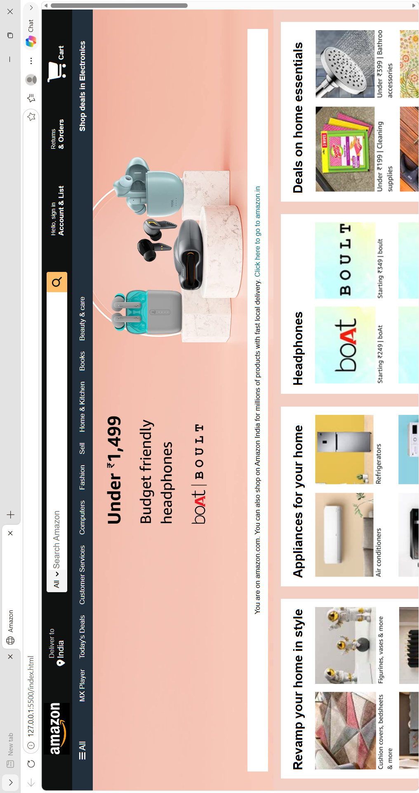
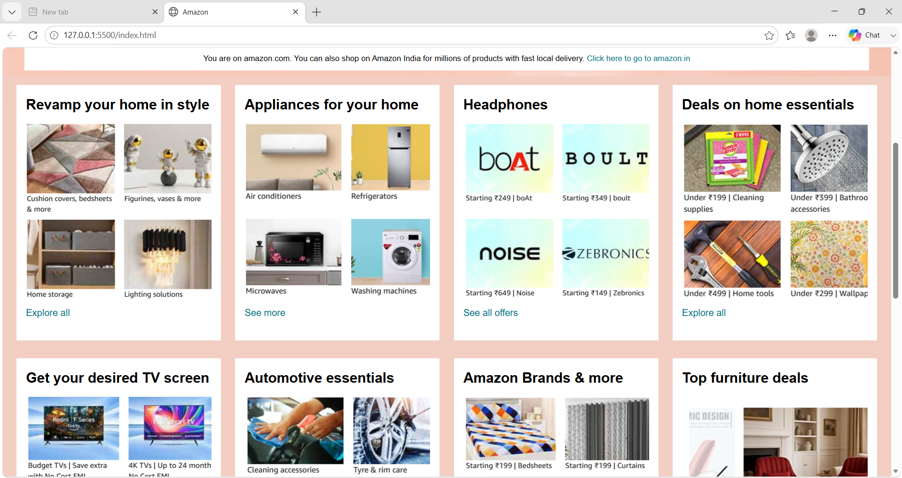
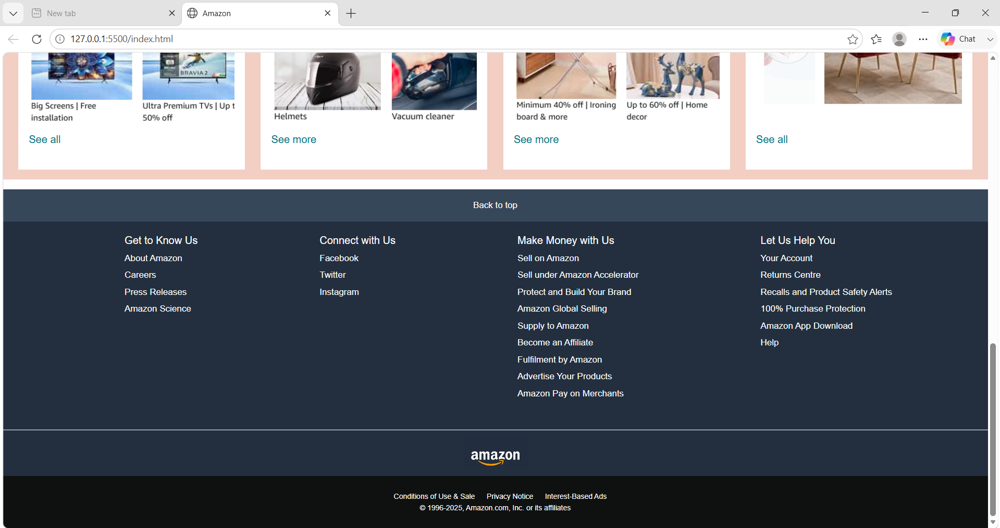

# Amazon-website-clone
A Amazon website clone built using HTML and CSS. 
This project is created to practice front-end web development, page layout and design.

## Features 
- Amazon inspired homepage
- Navigation bar 
- Hero section 
- Products categories 
- Footer section 
- clean and organized layout

## Technological used 
- HTML 
- CSS 

## Project Structure 
Amazon-Website-Clone/
|--index.html
|--style.css
|--images/
|--README.md

## How to run this repository
1. Download or clone this repository. 
2. Open the project folder.
3. Open 'index.html' in your browser.

## Screenshots

## Author 
** Leena Paunikar **
B.Tech Computer Science and Engineering 
Learning web development, Java and DSA
